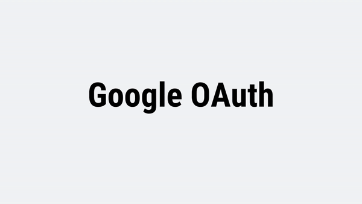

# Form. 
A smart form with authentication, signup, signin and many other features
( along with some micro-animations )

[Live Link](https://masterpranay1.github.io/Smart-Form/) -> Hosted using Github Pages

  

## Tools Used

- HTML
- SCSS
- Vanilla JS
- Firebase Auth
- Cloud Firestore
- GSAP animation library
- Figma ( for designing )
- Github Page

## Features

- Multi Step Sign Up Form
- Form Validation
- Storing User data to Firestore
- Sign up and sign in users using firebase auth
- Small microinteractions using GSAP
- Fully Responsive Page

## Sign Up Page

## Sign In Page

## Feature Page

## Validations

 

## Google Authentication

## Fully Resposive

 

## NEW LEARNINGS

1. Learned to integrate firebase oauth 
    - using email and password
    - using google account
2. Saving file to firebase cloud storage
3. Using GSAP animations ( however only usage but i learned to use them )

## Topics Revised

- SCSS mixin, partials, variables
- Responsive Design
- Figma Desiging
- Using Vanilla Js

## Difficuilties Faced

During the developement, I realised the importance of understanding asynchronous behaviour of javascript ( I marked to it learn more about it ). 
Seting up the Authentication was the most enjoyable part of this project. Now I am plannin to work on a new big project with more advanced firebase usages.

## Issue And Contribution

Any issue or pull request are welcomed. I would to look over the issue and LEARN more them. Thanks.

## Author

I am Pranay raj, Passionate in programming and currently exploring about web dev. 
If you love this project, consider giving it a like.